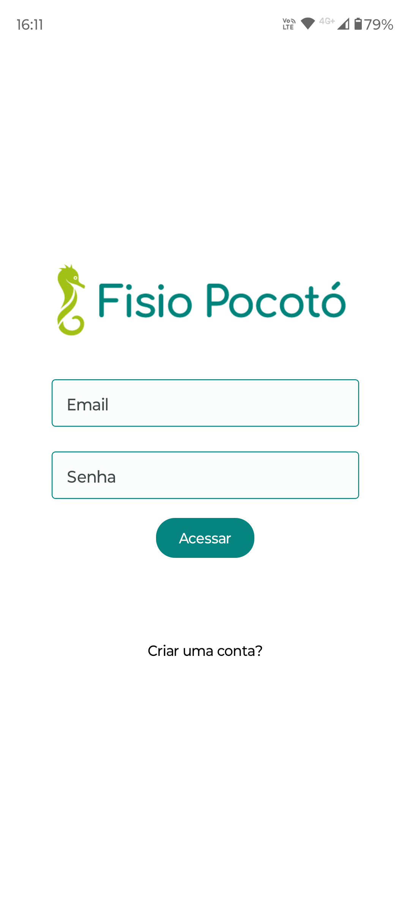
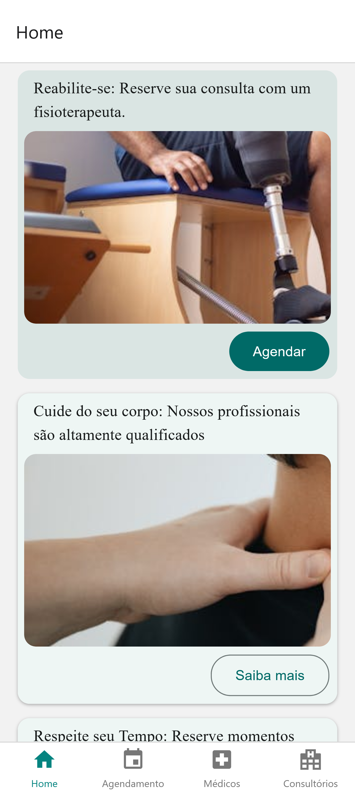
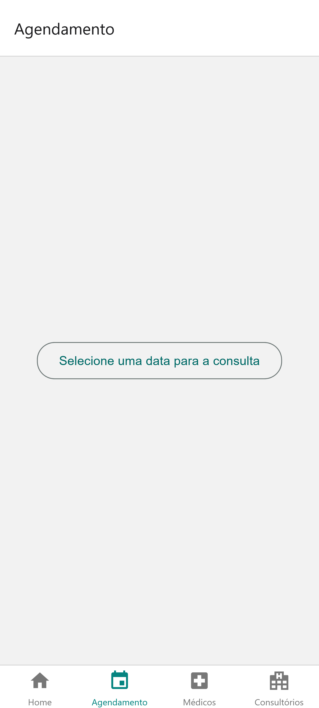
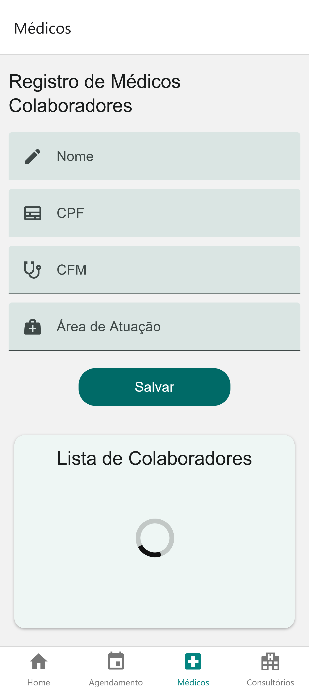

# 🐴 Fisio Pocotó

Fisio Pocotó foi um projeto desenvolvido durante as aulas da disciplina **Programação para Dispositivos Móveis** na Fatec Jales 📚.  


### 💡 O que é isso?

Fisio Pocotó é um app mobile criado para agendamento de consultas com fisioterapeutas e incentivos para atividades relacionadas à fisioterapia.

---

## 🛠️ Tecnologias Utilizadas

- 🧠 **React Native**  
- 🔥 **Google Firebase** (Autenticação e Realtime Database)  
- 🛠️ **Node.js**

---

## 🚀 Como rodar?

> **Atenção:** As credenciais do Firebase desse projeto foram descontinuadas, então algumas funcionalidades podem não funcionar 100% no seu ambiente local.

Mesmo assim, para fins educacionais ou curiosidade:

```bash
# Clone o repositório
git clone https://github.com/caiopereira-source/FisioPocoto.git

# Entre na pasta do projeto
cd FisioPocoto

# Instale as dependências
npm install

# Rode o projeto
npm start
```

📱 Para testar no emulador ou dispositivo físico, use o Expo Go ou um ambiente React Native que desejar.

⚠️ Lembrando! As credenciais do Firebase **não estão mais no repositório**.


---

## 📸 Screenshots do Projeto

<p float="left">
  
  
  
  
</p>

